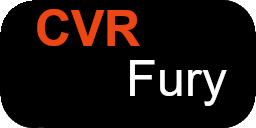

<a name="readme-top"></a>

<!-- PROJECT SHIELDS -->

<!--
*** I'm using markdown "reference style" links for readability.
*** Reference links are enclosed in brackets [ ] instead of parentheses ( ).
*** See the bottom of this document for the declaration of the reference variables
*** for contributors-url, forks-url, etc. This is an optional, concise syntax you may use.
*** https://www.markdownguide.org/basic-syntax/#reference-style-links
-->

[![Contributors][contributors-shield]][contributors-url]
[![Forks][forks-shield]][forks-url]
[![Stargazers][stars-shield]][stars-url]
[![Issues][issues-shield]][issues-url]
[![LGPL2 License][license-shield]][license-url]

<!-- PROJECT LOGO -->

<br />
<div align="center">
  <a href="https://repo.cvrfury.uk/">
    
  </a>

<h3 align="center">CVR Fury</h3>

<p align="center">
    <br />
    <a href="https://github.com/NovaVoidHowl/CVRFury"><strong>Explore the docs »</strong></a>
    <br />
    <br />
    <a href="https://github.com/NovaVoidHowl/CVRFury/issues">Report Bug</a>
    ·
    <a href="https://github.com/NovaVoidHowl/CVRFury/issues">Request Feature</a>
  </p>
</div>

<!-- TABLE OF CONTENTS -->

<details>
  <summary>Table of Contents</summary>
  <ol>
    <li>
      <a href='#⚠️-warnings-⚠️'>Warnings</a>
    </li>
    <li>
      <a href="#about-the-project">About The Project</a>
    </li>
    <li>
      <a href="#getting-started">Getting Started</a>
      <ul>
        <li><a href="#prerequisites">Prerequisites</a></li>
        <li><a href="#installation">Installation</a></li>
      </ul>
    </li>
    <li><a href="#feature-support">Feature Support</a></li>
    <li><a href="#roadmap">Roadmap</a></li>
    <li><a href="#contributing">Contributing</a></li>
    <li><a href="#license">License</a></li>
    <li><a href="#contact">Contact</a></li>
    <li><a href="#acknowledgments">Acknowledgments</a></li>
    <li><a href="#project-tools">Project tools</a></li>
  </ol>
</details>

<!-- WARNINGS -->

## ⚠️ Warnings ⚠️

Currently this software is only compatible with versions of VRC Fury older than 1.744, as that version introduced
a breaking change in the components and this will need new stubs creating for them before they can be supported

<p align="right">(<a href="#readme-top">back to top</a>)</p>

<!-- ABOUT THE PROJECT -->

## About The Project

The aim of this project is to create a tool kit that can process VRCFury supported content for use in ChilloutVR.

Note this project is in a pre-alpha state and not ready for any use yet.

______________________________________________________________________

See the [VRCFury Webpage](https://vrcfury.com/) for more info on the project that inspired this one.

<p align="right">(<a href="#readme-top">back to top</a>)</p>

<!-- GETTING STARTED -->

## Getting Started

TBC

### Prerequisites

Note the following should be auto installed to the project by adding this package

- com.unity.nuget.newtonsoft-json: 3.0.2
- com.unity.vectorgraphics: 2.0.0-preview.21

### Installation

1. In unity open the `Package Manager` window
2. Click the plus button in the top left of that window and choose the `Add packages from git URL` option
3. Paste in the git url of this repo `https://github.com/NovaVoidHowl/CVRFury.git`
4. Click the add button

The script should then be ready to use.

<p align="right">(<a href="#readme-top">back to top</a>)</p>

<!-- Feature Support -->

## Feature Support

Icon Key:

```text
✔️ = Feature active/supported.
⚙️ = Implementation/review in progress
❌ = Feature pending implementation.
🔼 = High priority.
🔽 = Low priority.
❔ = Feature pending review.
🚫 = Feature will not be supported.
```

The following table gives a breakdown of what features from VRCFury are supported for import/install.\
Note at this time there is no native config UI for CVRFury modules (save the dev debug interface)

|        Feature         | Data Import Supported | Install Supported | Notes                                                |
| :--------------------: | :-------------------: | :---------------: | :--------------------------------------------------- |
|   ObjectToggleAction   |          ✔️           |        ✔️         |                                                      |
|     MaterialAction     |          ✔️           |        ✔️         |                                                      |
|    BlendShapeAction    |          ✔️           |         ❌         |                                                      |
|      SpsOnAction       |           🚫           |         🚫         |                                                      |
|     FxFloatAction      |          ✔️           |        ❌🔽         |                                                      |
|  AnimationClipAction   |          ❔🔽           |        ❔🔽         |                                                      |
| ShaderInventoryAction  |          ❔🔽           |        ❔🔽         |                                                      |
|  PoiyomiUVTileAction   |          ❔🔽           |        ❔🔽         |                                                      |
| MaterialPropertyAction |          ❔🔽           |        ❔🔽         |                                                      |
|      ScaleAction       |          ✔️           |         ❌         |                                                      |
|  BlockBlinkingAction   |          ✔️           |        ✔️         |                                                      |
|   BlockVisemesAction   |          ✔️           |        ✔️         |                                                      |
|  ResetPhysboneAction   |           🚫           |         🚫         | No Physbones in CVR, hence not needed                |
| FlipBookBuilderAction  |           ❔           |         ❔         |                                                      |
|                        |                       |                   |                                                      |
|        Blinking        |           ❔           |         ❔         |                                                      |
|       Breathing        |           ❔           |         ❔         |                                                      |
|     FullController     |          ✔️           |        ⚙️         |                                                      |
|         Toggle         |          ❌🔽           |        ❌🔽         |                                                      |
|         Puppet         |           ❔           |         ❔         |                                                      |
|      SecurityLock      |          ❌🔽           |        ❌🔽         |                                                      |
|   SenkyGestureDriver   |           🚫           |         🚫         |                                                      |
|        Talking         |          ❌🔽           |        ❌🔽         |                                                      |
|      Toes Puppet       |          ❌🔽           |        ❌🔽         |                                                      |
|    Advanced Visemes    |           ❔           |         ❔         |                                                      |
|      ArmatureLink      |          ✔️           |        ❌🔼         |                                                      |
|     BoundingBoxFix     |          ❔🔽           |        ❔🔽         |                                                      |
|     BoneConstraint     |           🚫           |         🚫         | Not in VRCFury UI, likely superseded by ArmatureLink |
|    FixWriteDefaults    |          ❔🔽           |        ❔🔽         |                                                      |
|   RemoveHandGestures   |          ❌🔽           |        ❌🔽         |                                                      |
|      CrossEyeFix       |           🚫           |         🚫         |                                                      |
|   AnchorOverrideFix    |          ❔🔽           |        ❔🔽         |                                                      |
|      MoveMenuItem      |          ❔🔽           |        ❔🔽         |                                                      |
|     GestureDriver      |          ❔🔽           |        ❔🔽         |                                                      |
|         Gizmo          |          ❌🔽           |        ❌🔽         |                                                      |
|   DeleteDuringUpload   |          ✔️           |        ✔️         |                                                      |
|     BlendShapeLink     |          ❔🔽           |        ❔🔽         |                                                      |
|        SetIcon         |           🚫           |         🚫         | There are no icons on CVR menus                      |
|  OverrideMenuSettings  |           🚫           |         🚫         | Related to VRC menu structure only                   |
|  BlendshapeOptimizer   |          ❔🔽           |        ❔🔽         |                                                      |
|        Slot4Fix        |           ❔           |         ❔         |                                                      |
|  DirectTreeOptimizer   |          ❔🔽           |        ❔🔽         |                                                      |
|   ShowInFirstPerson    |          ✔️           |        ✔️         |                                                      |
|       SpsOptions       |           🚫           |         🚫         |                                                      |
|    MmdCompatibility    |          ❔🔽           |        ❔🔽         |                                                      |

## Things that are not included

The following are not features of this project, you will need to handle the following conversions by hand,
or find a tool that can do them.

- PhysBone to Dynamic Bone conversion
- PhysBone to Magica Cloth (1 or 2) conversion

<p align="right">(<a href="#readme-top">back to top</a>)</p>

<!-- ROADMAP -->

## Roadmap

- [x] VRCExpressionParameters Converter and Stub

- [x] VRCExpressionMenu Converter and Stub

- [x] PhysBone Stubber - (just stubs them NOT a converter)

- [x] VRCFury stubs - pre version 1.744

- [ ] VRCFury stubs - version and on 1.744

- [ ] VRCFury to CVRFury data porter

- [ ] CVRFury VRCStub to VRC Converter (potential)

- [ ] More to come ......

See the [open issues](https://github.com/NovaVoidHowl/CVRFury/issues) for a full list of proposed features (and known issues).

<p align="right">(<a href="#readme-top">back to top</a>)</p>

<!-- CONTRIBUTING -->

## Contributing

Contributions are what make the open source community such an amazing place to learn, inspire, and create.
Any contributions you make are **appreciated**. Please see [CONTRIBUTING.md](CONTRIBUTING.md) for more details.

If you have a suggestion that would make this better, please fork the repo and create a pull request.
You can also simply open an issue with the tag "enhancement".

1. Fork the Project
2. Create your Feature Branch (`git checkout -b feature/AmazingFeature`)
3. Commit your Changes (`git commit -m 'Add some AmazingFeature'`)
4. Push to the Branch (`git push origin feature/AmazingFeature`)
5. Open a Pull Request

<p align="right">(<a href="#readme-top">back to top</a>)</p>

<!-- LICENSE -->

## License

Please see [LICENSE.md](LICENSE.md) for information.

<p align="right">(<a href="#readme-top">back to top</a>)</p>

<!-- CONTACT -->

## Contact

[@NovaVoidHowl](https://novavoidhowl.uk/)

Project Link: [https://repo.cvrfury.uk](https://repo.cvrfury.uk)

<p align="right">(<a href="#readme-top">back to top</a>)</p>

<!-- ACKNOWLEDGMENTS -->

## Acknowledgments

### VRCFury

This repo contains stub components (in the folder VRCFury_stub), that are derivative of the VRCFury
codebase, please see <https://github.com/VRCFury/VRCFury>, unlike the rest of the code in this repo the VRCFury stubs
are licensed under CC BY-NC 4.0

### Avatars-3.0-Manager

This project makes use of the Animator Controller copying/merging logic.
Please see <https://github.com/VRLabs/Avatars-3.0-Manager/tree/main> for details
Licence MIT

<p align="right">(<a href="#readme-top">back to top</a>)</p>

<!-- PROJECT TOOLS -->

## Project tools

- VS Code, ide
- Pre-Commit, linting and error detection
- Github Copilot, Code error/issue analysis

<p align="right">(<a href="#readme-top">back to top</a>)</p>

<!-- MARKDOWN LINKS & IMAGES -->

<!-- https://www.markdownguide.org/basic-syntax/#reference-style-links -->

[contributors-shield]: https://img.shields.io/github/contributors/NovaVoidHowl/CVRFury.svg?style=plastic
[contributors-url]: https://github.com/NovaVoidHowl/CVRFury/graphs/contributors
[forks-shield]: https://img.shields.io/github/forks/NovaVoidHowl/CVRFury.svg?style=plastic
[forks-url]: https://github.com/NovaVoidHowl/CVRFury/network/members
[issues-shield]: https://img.shields.io/github/issues/NovaVoidHowl/CVRFury.svg?style=plastic
[issues-url]: https://github.com/NovaVoidHowl/CVRFury/issues
[license-shield]: https://img.shields.io/badge/License-LGPL_2.1-blue
[license-url]: https://github.com/NovaVoidHowl/CVRFury/blob/master/LICENCE.md
[stars-shield]: https://img.shields.io/github/stars/NovaVoidHowl/CVRFury.svg?style=plastic
[stars-url]: https://github.com/NovaVoidHowl/CVRFury/stargazers
